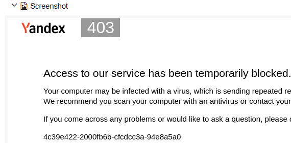
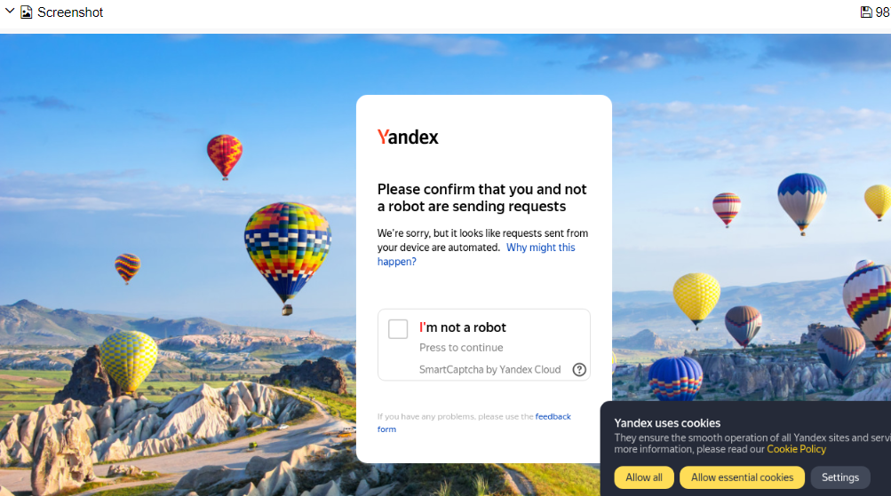

### Удаленное противо-captcha-стояние
Удаленное - в смысле при запусках в CI. С локальными запусками дела обстоят лучше.  
Про мою <ins>бессмысленную</ins> и беспощадную борьбу с защитами яндекса,
наверное, можно детектив писать, но отмечу лишь пару любопытных (впрочем,
не удивительных) моментов.
1. Яндекс на дух не переносит клиентские устройства, в которых браузер
   запущен в режиме `headless`:  
   
1. Выкорчевывание из http-заголовка `user-agent` подстроки "`Headless`"
   на результат влияет положительно: 
1. Хотя проблема и не решена, бывают
   <ins>[удачные запуски](https://achitheus.github.io/automationCucumber/16/#behaviors/2433d5c62c9d403236977a4a10dc6fdb/5a4d9e622c46a8d9/)</ins>,
   при которых капча каким-то чудом не срабатывает.
1. Судя по всему, если обращаться к ЯМаркет из экзотичных локаций, например:
   > Current location by IP: США, Редмонд  
   Current location by IP: Пуэрто-Рико, Сан-Антонио  
   Current location by IP: Великобритания, Вашингтон

   то:
    - город сервисом устанавливается дефолтный (Москва);
    - товаров может отображаться гораздо меньше, чем реально есть в Москве;
    - соответственно список производителей может быть пустым. Иногда вообще кажется,
      что сайт редиректит в какую-то полупустую и сильно урезанную заглушку.
