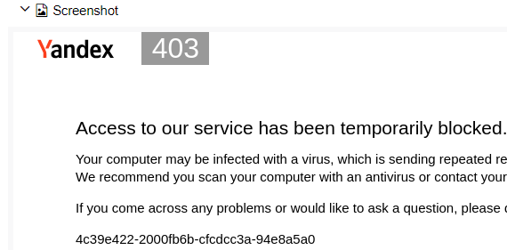

## Содержание
- [Build](#build)  
- [Allure report](#allure-report)  
- [Тест-кейс](#тест-кейс)
## Build
В окружении должна быть установлена (и прописана в PATH) java не ниже 11 версии
и добавлена переменная среды JAVA_HOME.   
Запуск:

    ./mvnw verify -Duse.chrome.profile=false

Посмотреть отчет:

    ./mvnw allure:install
    ./mvnw allure:serve

## Allure report
Здесь два подраздела. Ссылка на наиболее содержательный отчет ~~здорового
человека~~ находится
во <ins>[втором](#2-запуск-локально-и-деплой-отчета-руками)</ins>.
### 1. Удаленные запуск и деплой отчета джобой "GitHub Actions"
#### Если кратко:

Посмотреть отчет можно по <ins>[этой ссылке](https://achitheus.github.io/automationCucumber/17/)</ins>, причем
относительный интерес, по понятным причинам,
представляет собой только <ins>[этот удачливый тест-кейс](https://achitheus.github.io/automationCucumber/16/#behaviors/2433d5c62c9d403236977a4a10dc6fdb/5a4d9e622c46a8d9/)</ins> из предыдущего запуска.

#### Подробнее:

Про мою <ins>бессмысленную</ins> и беспощадную борьбу с защитами яндекса,
наверное, можно детектив писать, но отмечу лишь пару любопытных (впрочем,
не удивительных) моментов.
1. Яндекс на дух не переносит клиентские устройства, в которых браузер
запущен в режиме `headless`:  

1. Выкорчевывание из http-заголовка `user-agent` подстроки "`Headless`"
на результат влияет положительно: 
1. Хотя проблема и не решена, бывают удачные запуски, как, например,
   <ins>[упомянутый выше](https://achitheus.github.io/automationCucumber/16/#behaviors/2433d5c62c9d403236977a4a10dc6fdb/5a4d9e622c46a8d9/)</ins>
, при которых капча каким-то чудом не срабатывает.
1. Судя по всему, если обращаться к ЯМаркет из экзотичных локаций, например:
    > Current location by IP: США, Редмонд  
     Current location by IP: Пуэрто-Рико, Сан-Антонио  
     Current location by IP: Великобритания, Вашингтон  

    то:
    - город сервисом устанавливается дефолтный (Москва);
    - товаров может отображатсья гораздо меньше, чем реально есть в Москве;
    - соответственно список производителей может быть пустым. Иногда вообще кажется,
   что сайт редиректит в какую-то полупустую и сильно урезанную заглушку.

Так или иначе при удаленном запуске через селеноид обходить капчи и прочие препятствия
тяжелее, соответственно и нормальный отчет таким путем сделать затруднительно. Поэтому более
целесообразным представляется выполнить...

### 2. Запуск локально и деплой отчета руками
Посмотреть отчет можно по <ins>[этой ссылке](https://achitheus.github.io/automationCucumber/local-run/)</ins>.
## Тест-кейс
Используя BDD подход и фреймворк Cucumber реализовать следующее:
1. Открыть браузер и развернуть на весь экран.
1. Зайти на https://ya.ru/
1. Нажать на строку поиска -> Кликнуть по Маркет
1. Перейти в Каталог -> Навести курсор на раздел Электроника
1. Выбрать раздел Смартфоны
1. Задать параметр «Производитель» Apple.
1. Дождаться результатов поиска.
1. Убедиться, что в выборку попали только iPhone. Если страниц несколько – проверить все.

Тест должен работать для любого производителя из списка:
- ASUS
- Black Shark
- OnePlus
- Google
- Seals
